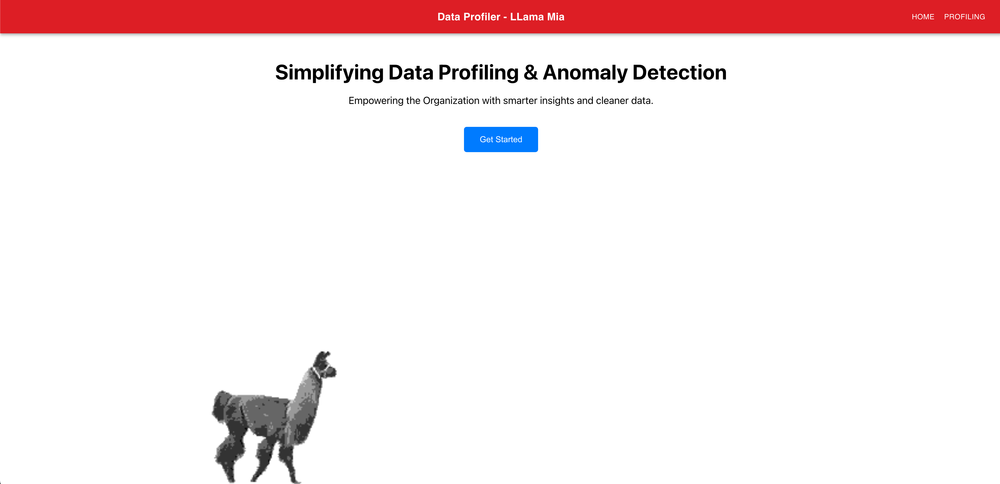
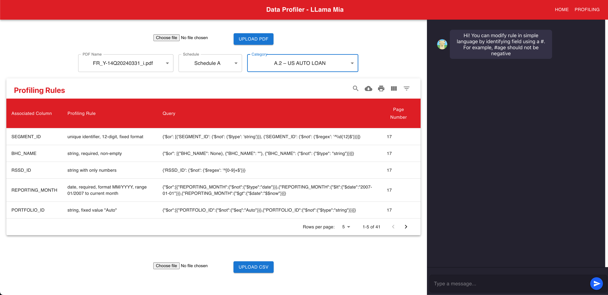
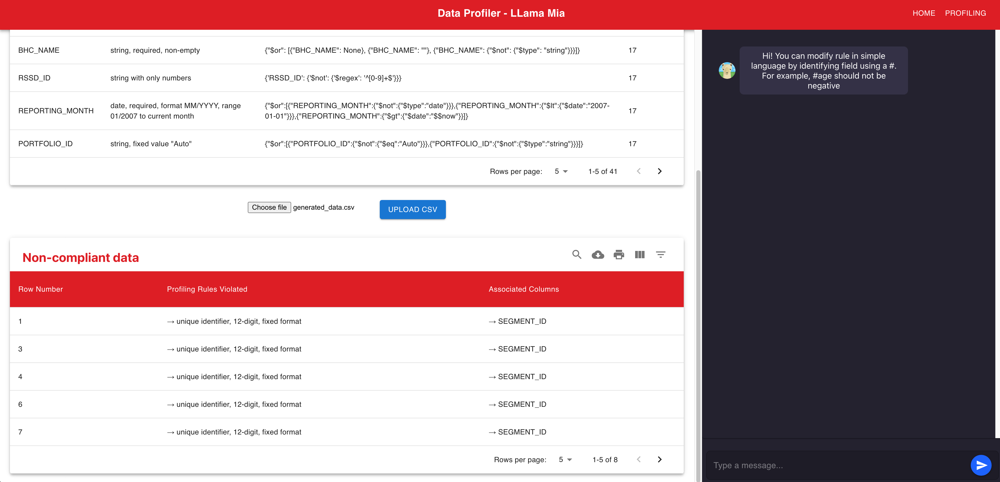
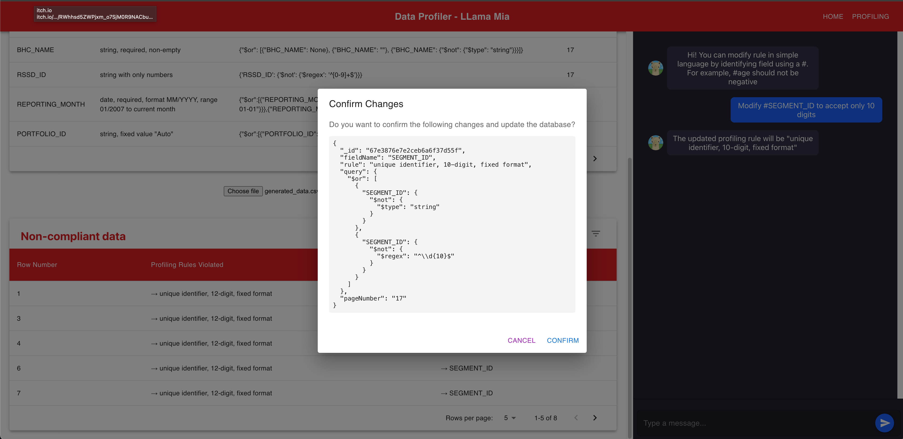
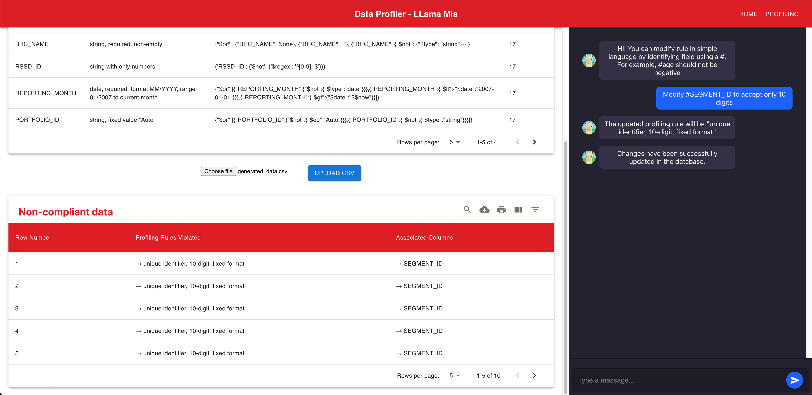

# 🚀 Project Name

## 📌 Table of Contents

- [Introduction](#introduction)
- [Demo](#demo)
- [Inspiration](#inspiration)
- [What It Does](#what-it-does)
- [How We Built It](#how-we-built-it)
- [Challenges We Faced](#challenges-we-faced)
- [How to Run](#how-to-run)
- [Tech Stack](#tech-stack)
- [Team](#team)

---

## 🎯 Introduction

This GenAI-powered data profiling solution automates the extraction, interpretation, and validation of regulatory reporting requirements. It leverages LLMs to generate profiling rules, and an interactive assistant for compliance refinement, ensuring scalable and explainable regulatory data validation.

## 🎥 Demo

📹 [Video Demo](https://drive.google.com/file/d/1kOJJveQi887PlvuWRI4NvtraAMCrhWrr/view?usp=share_link)  
🖼️ Screenshots:

## 💡 Inspiration

Regulatory compliance is complex and manually intensive, often leading to errors and inefficiencies. This solution aims to leverage GenAI and ML to automate data validation, enhance accuracy, and streamline compliance processes.

## ⚙️ What It Does

This solution processes regulatory documents and CSV data, detects rule violations using LLMs and anomaly detection, and allows users to refine compliance rules via a chatbot-driven web interface. It also automates database updates based on extracted insights.

## 🛠️ How We Built It

Our solution is designed as a scalable and modular system integrating AI-driven data profiling with an interactive compliance assistant.

Frontend (React): We built a user-friendly web interface that allows users to upload regulatory documents and CSV data, interact with an LLM-powered chatbot, and review flagged anomalies.
Backend (FastAPI): The backend processes user inputs, manages document parsing, runs validation checks, and interacts with the LLM for rule extraction and refinement.
Database (MongoDB): All extracted profiling rules, validation results, and user updates are stored in MongoDB, ensuring efficient querying and updates.
LLM Integration (Groq API): We leverage Groq API for processing regulatory instructions, interpreting prompts, and generating validation rules, enabling automated compliance insights.
This end-to-end pipeline seamlessly connects data ingestion, AI-driven profiling, and real-time compliance validation while keeping the system efficient and adaptable.

## 🚧 Challenges We Faced

Challenges We Faced

1) Complexity in Regulatory Interpretation: Extracting and interpreting rules from unstructured regulatory documents required LLM fine-tuning and prompt engineering to ensure accuracy.
2) Ensuring High Accuracy in Rule Generation: Generating precise validation rules from regulatory text was challenging, as some rules required cross-referencing multiple sections.
3) Handling Large Datasets Efficiently: Processing large CSV files for anomaly detection and validation checks while keeping response times low required MongoDB optimizations and asynchronous FastAPI processing.
4) Real-Time Data Violation Checks: Executing validation rules as MongoDB queries in real time while ensuring low latency was challenging, requiring query indexing and efficient aggregation pipelines.
5) LLM Limitations & Cost Considerations: Using the Groq API (free tier) had constraints on query limits and response times, requiring us to optimize API calls and cache responses where possible.
6) Dynamic Rule Updates & User Feedback Loop: Allowing users to iteratively refine rules through the chatbot required a flexible and explainable system, ensuring generated rules were editable and understandable.

## 🏃 How to Run

1) [Backend Setup Guide](code/src/backend/README.md)
2) [Frontend Setup Guide](code/src/frontend/README.md)

## 🏗️ Tech Stack

- 🔹 Frontend: React 
- 🔹 Backend: FastAPI
- 🔹 Database: MongoDB
- 🔹 Other: Groq API(LLM chat endpoints - Free tier) 

## 👥 Team

- **Parth Shukla** - [GitHub](https://github.com/ParthS28) | [LinkedIn](https://www.linkedin.com/in/parthsh/)
- **Agastya Varma** - [GitHub](https://github.com/agastya2002) | [LinkedIn](https://www.linkedin.com/in/agastya-varma/)
- **Agniva Basak** - [GitHub](https://github.com/agnivabasak) | [LinkedIn](https://www.linkedin.com/in/agniva-basak-b40b31115/)
- **Prithvi Shenoy** - [GitHub](https://github.com/prithvi-shenoy) | [LinkedIn](https://www.linkedin.com/in/prithvi-shenoy-7517441aa/)
- **Kristen Matthew Dsouza** - [GitHub](https://github.com/Kris-Dsz) | [LinkedIn](https://www.linkedin.com/in/kristen-mathew-dsouza/)
